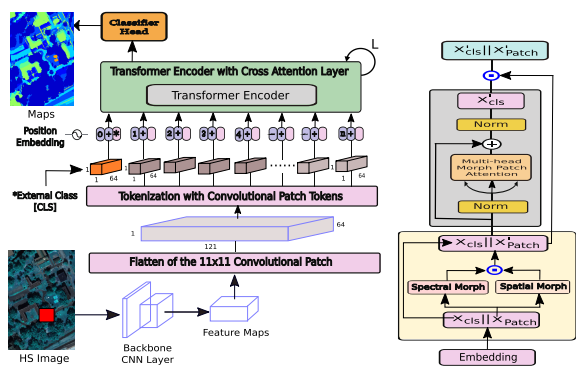

# Spectral–Spatial Morphological Attention Transformer for Hyperspectral Image Classification
The Code for "Spectral–Spatial Morphological Attention Transformer for Hyperspectral Image Classification". [https://ieeexplore.ieee.org/document/9347550]
```
Swalpa Kumar Roy, Ankur Deria, Chiranjibi Shah, Juan M Haut, Qian Du, Antonio Plaza.
Spectral–Spatial Morphological Attention Transformer for Hyperspectral Image Classification
IEEE Transactions on Geoscience and Remote Sensing
DOI: 10.1109/TGRS.2023.3242346
February 2023.
```



### Example of use
```
python mainHouston.py
```
